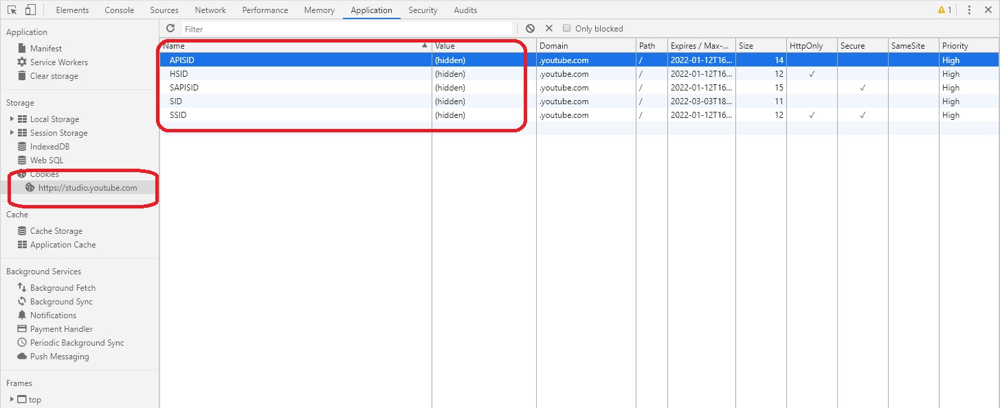
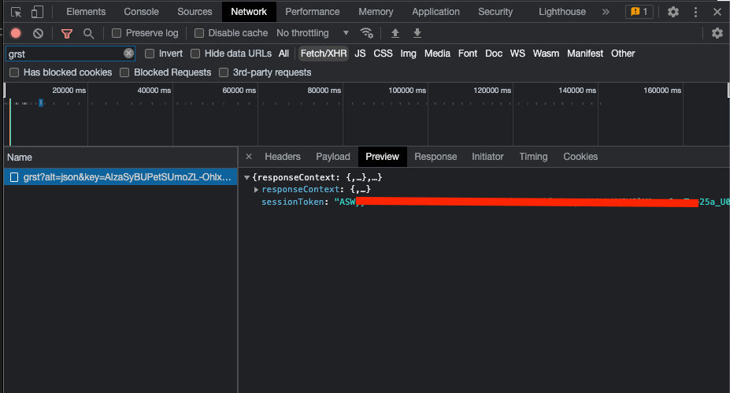

# youtube-studio

[](https://www.npmjs.org/package/youtube-studio)
[](https://www.npmjs.org/package/youtube-studio)


Unofficial YouTube Studio API.
Set of features **limited** or **not provided** by official YouTube API

**BEWARE: API will change during upcomming releases**

## Features
- setting monetisation
- uploading video (**NOT LIMITED** - official API's [`videos.insert`](https://developers.google.com/youtube/v3/determine_quota_cost) **charges you 1600 quota units**)
- setting / getting endscreen
- setting info cards
- getting video claims
- getting video details
- setting video comment options

## Installation

```sh
$ npm i -SE youtube-studio
```

## Setting monetisation

```js
const { init, setMonetisation } = require('youtube-studio')

await init({ ... }) // read more below (Preparing Authentication)

const result = await setMonetisation({
    encryptedVideoId: 'hHbWF1Bvgf4', // your video ID
    monetizationSettings: {
        newMonetizeWithAds: true // Monetisation: On
    },
    adFormats: { // Type of ads
        newHasOverlayAds: 'ENABLED', // Overlay ads
        newHasProductListingAds: 'ENABLED', // Sponsored cards
        newHasSkippableVideoAds: 'DISABLED', // Skippable video ads
        newHasNonSkippableVideoAds: 'ENABLED', // Non-skippable video ads
        
    },
    adBreaks: { // Location of video ads
        newHasPrerolls: 'DISABLED' // Before video
        newHasMidrollAds: 'DISABLED', // During video
        newHasManualMidrolls: 'DISABLED', // Manual placement (not yet provided)
        newHasPostrolls: 'ENABLED', // After video
        
    },
})

console.log(result)
```

## Uploading video

Official API's [`videos.insert`](https://developers.google.com/youtube/v3/determine_quota_cost) resource **charges you 1600 quota units** per single video upload.

```js
const fs = require('fs')
const { init, upload } = require('youtube-studio')

await init({ ... }) // read more below (Preparing Authentication)

const result = await upload({
    channelId: 'UCzQUP1qoWDoEbmsQxvdjxgQ', // your channelId
    stream: fs.createReadStream('./example=video.mp4'), // your video stream

    newTitle: 'new video 1', // optional, your video name
    newDescription: 'Please, subscribe!', // optional, your video description
    newPrivacy: 'PRIVATE', // optional (PRIVATE by default), ('PUBLIC', 'UNLISTED', 'PRIVATE' options available)
    isDraft: false, // optional, video can be a draft (false by default)
})

console.log(result)
```

Full example with 'progress' feature available in [`/examples/upload.js`](https://github.com/adasq/youtube-studio/blob/master/examples/upload.js)

## Setting endscreen

```js
const { init, setEndScreen, endScreen } = require('youtube-studio')

await init({ ... }) // read more below (Preparing Authentication)

const videoLengthSec = 1404
const TWENTY_SEC_BEFORE_END_MS = (videoLengthSec - 20) * 1000

const result = await setEndScreen(VIDEO_ID, TWENTY_SEC_BEFORE_END_MS, [
    { ...endScreen.TYPE_RECENT_UPLOAD }, // recent upload in top left position
    { ...endScreen.POSITION_BOTTOM_RIGHT, ...endScreen.TYPE_SUBSCRIBE(CHANNEL_ID) }, // subscribe button
    { ...endScreen.POSITION_TOP_RIGHT,    ...endScreen.TYPE_BEST_FOR_VIEWERS,      ...endScreen.DELAY(500) }, // best for viewers delayed with 0.5 sec
    { ...endScreen.POSITION_BOTTOM_LEFT,  ...endScreen.TYPE_PLAYLIST(PLAYLIST_ID), ...endScreen.DELAY(1000) } // playlist delayed with 1 sec
])
    
console.log(result)
```

## Getting endscreen

```js
const { init, getEndScreen } = require('youtube-studio')

await init({ ... }) // read more below (Preparing Authentication)

const result = await getEndScreen(VIDEO_ID)
    
console.log(result.endscreens[0].elements) // see more in unit tests
```

## Getting video details

```js
const { init, setEndScreen, endScreen } = require('youtube-studio')

await init({ ... }) // read more below (Preparing Authentication)

const result = await getVideo(VIDEO_ID)

const video = result.videos[0]

console.log(video.status) // VIDEO_STATUS_PROCESSED
console.log(video.monetization.adMonetization.effectiveStatus) // VIDEO_MONETIZING_STATUS_MONETIZING_WITH_LIMITED_ADS
console.log(video.lengthSeconds) // '1404'
console.log(video.watchUrl) // '1404'
```

## Setting info cards

```js
const { init, setInfoCards } = require('youtube-studio')

await init({ ... }) // read more below (Preparing Authentication)

const result = await setInfoCards(VIDEO_ID, [{
    playlistId: PLAYLIST_ID,
    teaserStartMs: 15000,
    customMessage: 'Check this one:',
    teaserText: 'If you need more...'
}])
```

## Getting video claims

```js
const { init, getVideoClaims } = require('youtube-studio')

await init({ ... }) // read more below (Preparing Authentication)

const result = await getVideoClaims(CLAIMS_VIDEO_ID)
            
const humanizedClaims = result.receivedClaims.map(claim => {
    const audio = claim.asset.metadata.soundRecording
    const timestamp = claim.matchDetails
    
    return `"${audio.title}", by ${audio.artists.join(', ')} (starting at ${timestamp.longestMatchStartTimeSeconds} sec.)`
})

console.log(humanizedClaims) // ['"Fasl", by Kabul Dreams (starting at 2771 sec.)', ...]
```

## Setting video comment options
### Enable all video comments
```js
const { init, setCommentOptions } = require('youtube-studio')

await init({ ... }) // read more below (Preparing Authentication)

const result = await setCommentOptions({
    encryptedVideoId: 'hHbWF1Bvgf4', // your video ID
    commentOptions: {
        newAllowCommentsMode: "ALL_COMMENTS", // or "AUTOMATED_COMMENTS" or "APPROVED_COMMENTS" or "UNKNOWN_COMMENT_ALLOWED_MODE",
        newAllowComments: true, // should be "false" for newAllowCommentsMode="UNKNOWN_COMMENT_ALLOWED_MODE"
        newCanViewRatings: true, // Show how many viewers like and dislike this video
        newDefaultSortOrder: "MDE_COMMENT_SORT_ORDER_LATEST" // or "MDE_COMMENT_SORT_ORDER_TOP"
    }
})

console.log(result)
```
### Disable video comments:
```js
const { init, setCommentOptions } = require('youtube-studio')

await init({ ... }) // read more below (Preparing Authentication)

const result = await setCommentOptions({
    encryptedVideoId: 'hHbWF1Bvgf4',
    commentOptions: {
        newAllowCommentsMode: "UNKNOWN_COMMENT_ALLOWED_MODE",
        newAllowComments: false,
        newCanViewRatings: true, // Show how many viewers like and dislike this video
        newDefaultSortOrder: "MDE_COMMENT_SORT_ORDER_LATEST"
    }
})

console.log(result)
```

## Preparing Authentication

#### 1. Authenticate to studio.youtube.com

It's recommended to do it in a browser's **private mode**.

#### 2. Open dev tools and copy specific cookie values

**IMPORTANT**: you need to filter cookies by `.youtube.com` domain.

Here's a list of required cookies:
- `SID`
- `HSID`
- `SSID`
- `APISID`
- `SAPISID`
- `LOGIN_INFO` (if available)

...like here:



#### 3. Get `SESSION_TOKEN`

If you plan to use `setMonetisation()` or `upload()` functions, you need to have `SESSION_TOKEN`.

**IMPORTANT**: Keep in mind, that you need to regenerate this value roughly each week.

Use your dev tools to get the value of `SESSION_TOKEN`:



#### 4. Initialize your session:

```js
const { init, getVideo } = require('youtube-studio')

(async () => {
    await init({
        SID,
        HSID,
        SSID,
        APISID,
        SAPISID,
        LOGIN_INFO, // specify, if available in your cookies
        SESSION_TOKEN // this is optional, see point 3. above
    }) // you can authenticate once!

    const video = await getVideo('your video id')
    console.log(video)
}())

```
